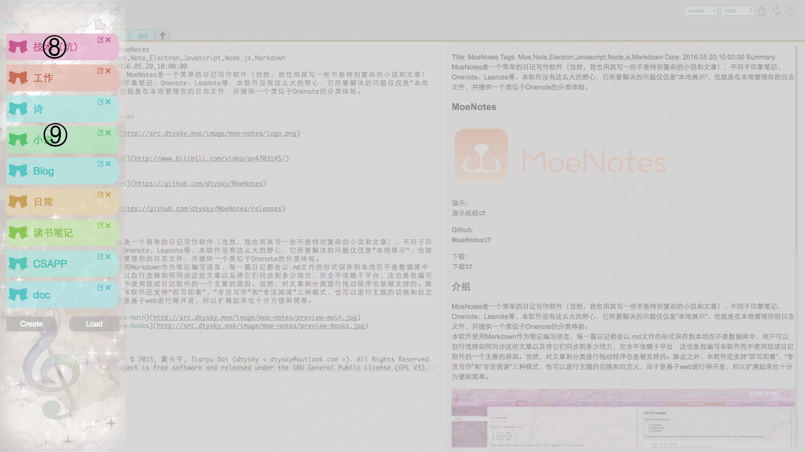

# 快速开始

## 初次使用

第一次打开应用时将会弹出一个对话框，此时只需要创建或选择一个空文件夹并打开，你的第一个笔记就被自动创建完成了，至此便可以自由使用本软件。

## 文件结构

笔记本的文件结构如下：  

    book  
    ├──.tree
    ├──chapter1  
    |       ├──page1
    |       └──age2
    |
    ├──chapter2
            ├──page1
            └──page2
    ......

笔记本的正文按照两级存储，目录作为分类，笔记存储于目录下，隶属于分类。.tree文件则用于保存本软件所必要的一些重要信息。

**注意，分类或者笔记名字不能有特殊字符！也不能有“/”等。**

## 用户UI

按照下图，可以将软件界面分为若干功能区：  

  
  

### 1. BOOK按钮

点击后将会打开笔记本列表，如上面第二张图。  

### 2. 分类列表

一个横向的列表，列出该笔记本内的所有分类，最后一个按钮用于在末尾添加一个新的分类，也可以使用⑦中选单的Create选项进行创建，同时删除、重命名等操作也是通过选单操作进行的。  
分类之间可以使用拖动进行重新排序。  

### 3. 文章列表

一个纵向的列表，列出某笔记本某章节内的所有笔记，第一个按钮用于添加一篇新的笔记，同样也可以使用选单进行创建，并进行拖动重新排序。

### 4. 编辑器

笔记的编辑区域，使用的是ACE Editor，没有右键菜单，快捷键与系统快捷键一致（例如在MAC下Home+F可以打开搜索框）。  
书写语言采用的是增强版的Markdown，整合了数学公式和表格等功能。  
整体遵循的是[GitHub Flavored Markdown](https://guides.github.com/features/mastering-markdown/)的规范。  
数学公式遵循的是[Tex](https://www.mathjax.org/)的规范。  
对于代码段，需要在代码段的开头加上`:::lang`（lang为代码语言），比如：  

    :::python
    print "x"
    
### 5. 预览区

对Markdown的效果进行实时转换，同步预览。  

### 6. 工具栏

从左至右分别是：  

1. 模式选择：一个下拉列表，可以选择normal（普通模式）、writing（专注写作模式）和view（专注阅读模式）。
2. 主题选择：一个下拉列表，可以切换已存在的主题。  
3. 导出：呼出导出选单，可导出为PDF或者HTML。  
4. 重载：重新加载应用。
5. 关于：关于本应用的一些信息。

### 7. 功能选单

在分类或者笔记列表的每个元素上右键可以呼出功能选单，每个选项的功能如下：  

1. Remove：删除该分类或者笔记，会同时从磁盘上删除，不可恢复。
2. Rename：给分类或者笔记重命名，同时会将实际文件重命名。
3. Create：新建一个分类/笔记，与使用创建按钮不同，它会在分类的右侧或者笔记的下侧创建。
4. Copy：暂且没有什么有意义的功能。  

### 8. 笔记本

每个笔记本元素由左侧的图标、名字和右上角的功能按钮构成：  

1. 图标：点击后切换到该笔记本。
2. 名字：在切换到改名模式后可以再次修改。
3. 功能按钮：左侧的是重命名，右侧的是删除。注意，笔记本的重命名和删除并不会对磁盘中的文件造成实际影响。  

### 9. 创建或加载笔记本

Create和Load按钮都可以打开一个系统对话框，不同的是前者允许你创建新的文件夹。选中一个文件夹打开后，如果文件夹自身有符合规范的笔记，本软件将会将其都默认加载进来并按照名称排序，如果没有，将会创建一个默认的分类和笔记。